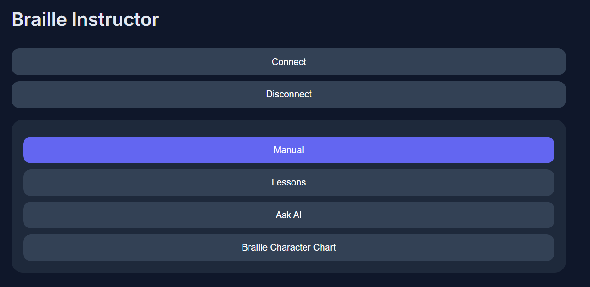
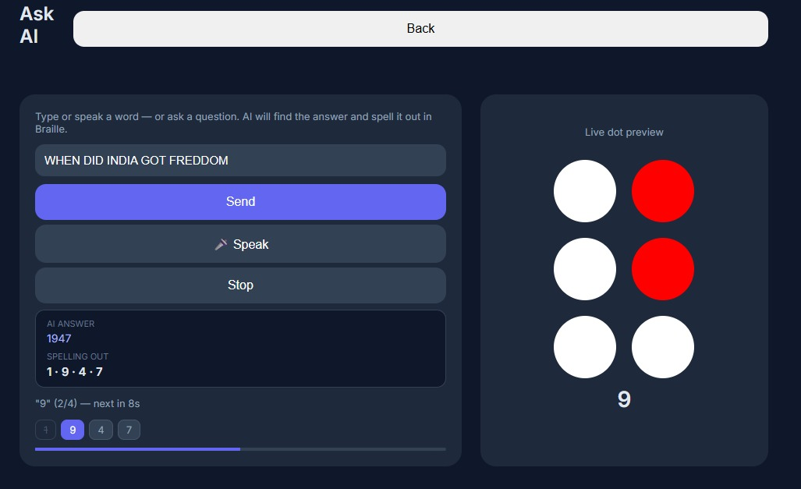

# AI-Powered Braille Companion

An assistive system that converts text, speech, and AI responses into physical Braille output using an Arduino-based device and a fully local AI backend.

---

## Overview

This system enables users to:

* Input text manually or via voice
* Ask factual questions
* Receive concise AI-generated answers
* Convert outputs into Braille
* Render Braille physically using a servo-driven device

The entire AI pipeline runs locally, without relying on external APIs.

---

## Visuals

### User Interface




## Key Capability

The system performs real-time transformation:

```text id="9k2w1q"
input → AI reasoning (if needed) → Braille encoding → physical output
```

---

## Example

**Input**

```
when did india get independence
```

**AI Output**

```
1947
```

**Result**

* Spoken output
* Visual preview
* Physical Braille actuation

---

## Architecture

* **Frontend** — HTML, CSS, JavaScript
* **Hardware** — Arduino (servo-based Braille output)
* **Backend** — Python (Flask server)
* **AI Engine** — llama.cpp running Phi-2

---

## Project Structure

```text id="3m0jhd"
.
├── index.html
├── style.css
├── app.js
├── braille_companion/
│   └── braille_companion.ino
├── braille_server/
│   └── server.py
├── docs/
│   ├── termux-setup.md
│   ├── llama-setup.md
│   ├── model-download.md
│   ├── python-server.md
│   └── running.md
```

---

## Design Decisions

* **Local AI over APIs**
  Eliminates dependency on external services and improves privacy

* **Minimal AI responses**
  Ensures efficient Braille rendering

* **Hardware integration**
  Provides tangible output instead of screen-only feedback

---

## Performance

* AI response latency: ~5–15 seconds
* Memory usage: ~4 GB total system
* Runs on standard Android devices with sufficient RAM

---

## Limitations

* Requires initial setup via Termux
* Model file (~1.6 GB) not included
* Performance depends on device capability

---

## Setup

Detailed setup instructions are available in:

```text id="6rfw7m"
/docs/
```

---

## Status

Working system with:

* local AI inference
* voice + manual input
* hardware output
* full offline capability

---

## License

For personal and educational use.
